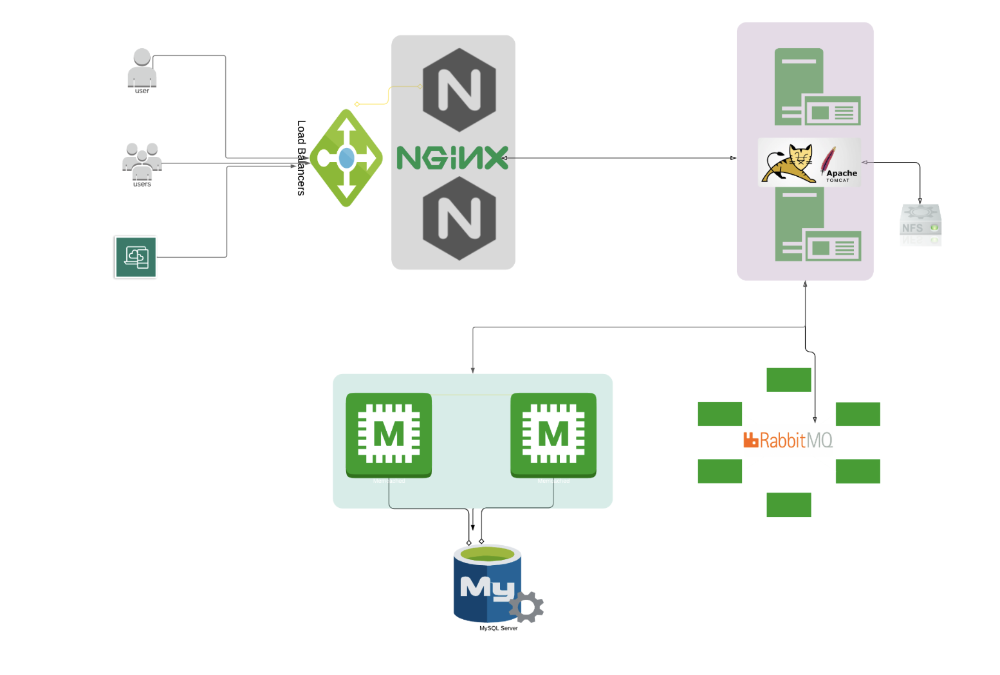

# VProfile Local Infrastructure - DevOps Portfolio Project

[](https://www.vagrantup.com/)
[](https://www.vmware.com/)
[](https://www.gnu.org/software/bash/)
[](https://www.mysql.com/)
[](https://nginx.org/)

## 🎯 Project Overview

This project demonstrates **automated multi-tier infrastructure provisioning** using modern DevOps practices. It showcases my ability to orchestrate complex backend environments with **Infrastructure as Code (IaC)** principles.

### 🎓 Learning Context
*This project was completed as part of the "DevOps Beginners to Advanced with Projects" course by Imran Teli, serving as a hands-on learning artifact to demonstrate practical DevOps skills.*

## 🚀 Key Achievements

- ✅ **Automated VM lifecycle management** with Vagrant
- ✅ **Multi-service orchestration** using shell scripting
- ✅ **Zero-manual configuration** deployment process
- ✅ **Production-ready service stack** simulation
- ✅ **Mac M1/M2 compatibility** with VMware integration

## 🛠️ Technology Stack

| Category | Technology | Purpose |
|----------|------------|---------|
| **Virtualization** | VMware + Vagrant | VM lifecycle management |
| **Automation** | Shell Scripts | Service provisioning |
| **Database** | MySQL/MariaDB | Data persistence |
| **Caching** | Memcached | Performance optimization |
| **Message Queue** | RabbitMQ | Asynchronous communication |
| **Application Server** | Apache Tomcat | Java application hosting |
| **Web Server** | Nginx | Reverse proxy & load balancing |

## 🎯 Project Objectives

Simulate a complete backend infrastructure using multiple VMs, with automated provisioning of each service using Vagrant and Shell scripts.

This project demonstrates:
- 🔧 **Infrastructure automation** using Vagrant
- 🐧 **Linux system administration** via shell scripting
- 🏗️ **Multi-tier backend service deployment**
- 🌐 **Network and firewall configuration**
- ☕ **WAR build and deployment** of a Java Spring application

## 🏗️ Architecture Overview



### Infrastructure Components
- **Frontend Layer**: Nginx (Load Balancer & Reverse Proxy)
- **Application Layer**: Apache Tomcat (Java Application Server)
- **Caching Layer**: Memcached (Performance Optimization)
- **Message Queue**: RabbitMQ (Asynchronous Communication)
- **Database Layer**: MySQL/MariaDB (Data Persistence)

## ⚙️ Prerequisites

Make sure the following are installed on your system:
- **VMware Workstation/Fusion**
- **Vagrant**
- **Git Bash** or compatible terminal
- **Hostmanager plugin**:

```bash
vagrant plugin install vagrant-hostmanager
```

## 🚀 Getting Started

1. **Clone this project:**

```bash
git clone https://github.com/egnicolas/FSIDV.git
cd FSIDV/Automated_provisioning_MacOSM1
```

2. **Boot up the environment (automated):**

```bash
vagrant up
```

This command will launch all five VMs and execute provisioning scripts automatically.

## 🔧 Automated Service Provisioning

Each service is provisioned through automated shell scripts triggered by the Vagrantfile.

**Provisioned components:**
1. **MySQL (db01)** – Automated MariaDB install, schema import, port open
2. **Memcached (mc01)** – Installed and configured on port 11211
3. **RabbitMQ (rmq01)** – Auto-installed with default admin user
4. **Tomcat + Java + Maven (app01)** – WAR deployed with build via Maven
5. **Nginx (web01)** – Reverse proxy config applied automatically

## 🌍 Accessing the Application

Once all VMs are up, access the deployed app via:

```
http://web01
```

*Note: You may need to update your `/etc/hosts` file based on local VM IPs.*

> **Default Credentials:**  
> Username: `admin_vp`  
> Password: `admin_vp`

## 📁 Project Structure

```
FSIDV/
├── ansible/                      # Ansible playbooks & templates for provisioning
│   ├── ansible.cfg
│   ├── site.yml
│   ├── tomcat_setup.yml
│   ├── vpro-app-setup.yml
│   └── templates/
├── assets/
│   └── infra.png                 # Architecture diagram
├── Automated_provisioning_MacOSM1/
│   ├── Vagrantfile
│   ├── backend.sh
│   ├── memcache.sh
│   ├── mysql.sh
│   ├── nginx.sh
│   ├── rabbitmq.sh
│   ├── tomcat.sh
│   └── tomcat_ubuntu.sh
├── Jenkinsfile                   # CI/CD pipeline definition
├── pom.xml                       # Maven project descriptor
├── readme.md
└── src/
    ├── main/
    │   ├── java/                 # Java source code
    │   ├── resources/            # Application configs & SQL
    │   └── webapp/               # Web resources (static, JSP, etc.)
    └── test/                     # Unit & integration tests
```

## 🧠 Why This Project?

This project reflects my skills in:
- **Infrastructure automation** with Vagrant + Shell
- **Linux provisioning and configuration**
- **Multi-VM orchestration**
- **Basic networking and firewall setup**
- **Java backend deployment practices**

It serves as a hands-on demonstration of core DevOps concepts.

## 🏁 Next Steps & Improvements

**Technical Enhancements:**
- Migrate to declarative IaC tools (Ansible, Terraform)
- Implement CI/CD pipelines with Jenkins/GitHub Actions
- Add comprehensive monitoring (Prometheus, Grafana, ELK Stack)
- Containerize services with Docker and orchestrate with Kubernetes
- Implement security scanning and compliance checks

**Architecture Improvements:**
- Add high availability and load balancing
- Implement backup and disaster recovery strategies
- Add SSL/TLS encryption and security hardening
- Create infrastructure diagrams and network topology documentation

## 📝 Portfolio Note

This project serves as a learning demonstration and portfolio piece showcasing practical DevOps skills. The original architecture and methodology are based on Imran Teli's course content. This implementation demonstrates my ability to understand, adapt, and execute complex infrastructure automation tasks.

**Skills Demonstrated:**
- Infrastructure as Code (IaC) principles
- Multi-tier application deployment
- Linux system administration
- Service orchestration and automation
- Version control and documentation practices
